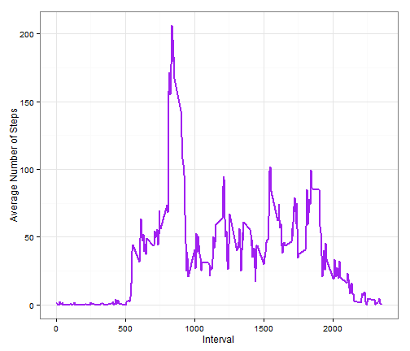
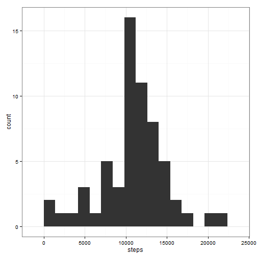
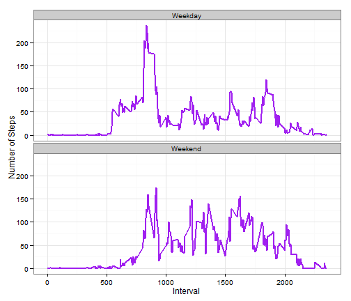

Reproducible Research - Peer Assessment 1
========================================================

Introduction
------------

It is now possible to collect a large amount of data about personal movement using activity monitoring devices such as a Fitbit, Nike Fuelband, or Jawbone Up. These type of devices are part of the "quantified self" movement - a group of enthusiasts who take measurements about themselves regularly to improve their health, to find patterns in their behavior, or because they are tech geeks. But these data remain under-utilized both because the raw data are hard to obtain and there is a lack of statistical methods and software for processing and interpreting the data.

This assignment makes use of data from a personal activity monitoring device. This device collects data at 5 minute intervals throughout the day. The data consists of two months of data from an anonymous individual collected during the months of October and November, 2012 and include the number of steps taken in 5 minute intervals each day.

Data
----

The data for this assignment can be downloaded from the course web site:
Dataset:  [Activity Monitoring Data] (https://d396qusza40orc.cloudfront.net/repdata%2Fdata%2Factivity.zip) [52K]
The variables included in this dataset are:

-  steps:  Number of steps taking in a 5-minute interval (missing values are coded as NA)
-	date:  The date on which the measurement was taken in YYYY-MM-DD format
-	interval:  Identifier for the 5-minute interval on which measurement was taken

The dataset is stored in a comma-separated-value (CSV) file and there are a total of 17,568 observations in the dataset.


Loading and Preprocessing the Data
----------------------------------

```r
get.data <- function (){
        if (!file.exists("data")) {
        message("Creating Data folder in working directory")
        dir.create("data")
        }
          
        if(!file.exists("data/repdata-data-activity")) {
        fileURL <- "http://d396qusza40orc.cloudfront.net/repdata%2Fdata%2Factivity.zip"
        download.file(fileURL, destfile = "./data/repdata-data-activity.zip")
        file.name <- "./data/repdata-data-activity.zip"
        unzip(file.name, exdir = "data")
        unlink(file.name)
}
else message("data already exists")
}
get.data()
activity <- read.csv("./data/activity.csv", colClasses = c("numeric", "Date", "numeric"))
activity$day <- weekdays(activity$date)
```

Steps Taken Per Day
-------------------

### Histogram of the total number of steps taken per day

```r
require(ggplot2)
```

```
## Loading required package: ggplot2
```

```r
activityAgg <- aggregate(steps ~ date, activity, sum, na.rm = TRUE)
qplot(steps, data = activityAgg, binwidth = 1400) +
theme_bw()
```

 

### Mean steps per day:

```r
median(activityAgg$steps)
```

```
## [1] 10765
```
### Median steps per day:

```r
mean(activityAgg$steps)
```

```
## [1] 10766
```

Average Daily Activity Pattern
------------------------------

### Time series plot of the 5-minute interval and the average number of steps taken, averaged across all days

```r
intervalAve <- aggregate(steps ~ interval, activity, mean, na.rm = TRUE)
ggplot(intervalAve, aes(x=interval,y=steps)) + 
geom_line(color="purple",size=1) +  
labs(x="Interval",y="Average Number of Steps") +
theme_bw()
```

 

### 5-minute interval containing the maximum number of steps (averaged across all days)

```r
intervalAve[which.max(intervalAve$steps),]$interval
```

```
## [1] 835
```

Imputing Missing Values
-----------------------

### Number of NA (missing) step values in the dataset

```r
sum(is.na(activity))
```

```
## [1] 2304
```

### Method for imputing missing step values

Missing step values (NA) were replaced by the mean number of steps taken for the corresponding time interval and weekday.  For example, if the mean number of steps taken in interval 5 on Mondays was 20 across the entire dataset, all NA entries for interval 5 on Mondays would be replaced with 20.

### A new dataset is created using the imputed values

```r
intdayAve <- aggregate(steps ~ interval + day, activity, mean, na.rm = TRUE)
activityImpute <- merge(activity, intdayAve, by=c("interval", "day"))
activityImpute <- transform(activityImpute, steps.x = ifelse(is.na(steps.x),steps.y,steps.x))
activityImpute <- data.frame(activityImpute[,1:4])
names(activityImpute) <- c("interval", "day","steps", "date")
activityImpute$steps <- round(activityImpute$steps, digits = 0)
activityImpute <- activityImpute[order(activityImpute$date, activityImpute$interval),]
```

### Histogram of the total number of steps taken per day with imputed values

```r
activityImputeAgg <- aggregate(steps ~ date, activityImpute, sum, na.rm = TRUE)
qplot(steps, data = activityImputeAgg, binwidth = 1400) +
theme_bw()
```

 

### Mean steps per day with imputed values:

```r
median(activityImputeAgg$steps)
```

```
## [1] 11015
```

### Median steps per day with imputed values:

```r
mean(activityImputeAgg$steps)
```

```
## [1] 10821
```

By including the imputed values in the dataset, both the median and the mean total number of steps taken per day increase, as expected. A comparison of histograms
for the non-imputed and imputed datasets demonstrates that the imputation had the greatest impact on the 10,000 - 15,000 steps per day range and that the distribution
of data with the imputed data appears to be more normal.

Investigating Differences in Activity Patterns Between Weekdays and Weekends
----------------------------------------------------------------------------


```r
activityImpute$daytype <- ifelse(activityImpute$day %in% c("Saturday", "Sunday"),"Weekend", "Weekday")
activityImputeDayAgg <- aggregate(steps ~ interval + daytype, activityImpute, mean)
ggplot(activityImputeDayAgg, aes(x=interval,y=steps)) + 
geom_line(color="purple",size=1) + 
facet_wrap(~daytype, nrow=2, ncol=1) + 
labs(x="Interval",y="Number of Steps") +
theme_bw()
```

 
